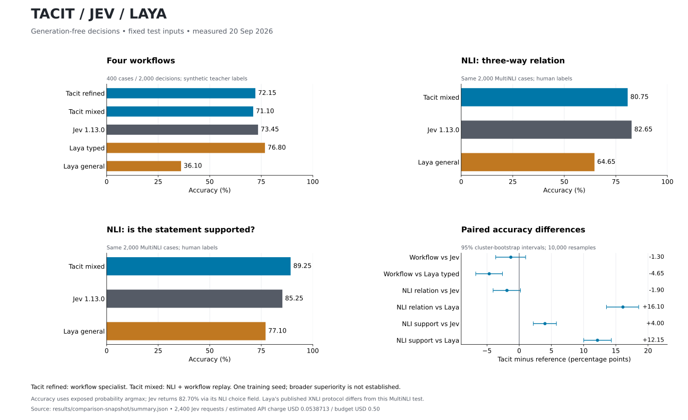

# Tacit

**A small System 1 decision core: events in, probabilities and typed decisions out.**

Tacit 0.2 focuses on continuous classification, routing, scoring and state
updates. It has no language generation objective. A new `SignalTacit` path takes
numeric events directly, with no tokenizer or text encoder; the `Tacit` text
interface below remains available for trained text-decision tasks.

- Resumable chunked streaming, with byte-step numerical parity tests.
- Shared state encoding and batched runtime-defined question scoring.
- Fixed-schema numeric decisions, explicit latest-value memory and missing-field masks.
- Decision-only cross entropy, Brier/ordinal losses, per-schema temperature
  fitting and prediction sets that abstain on empty or ambiguous sets.
- A reproducible, subject-disjoint sensor benchmark and a small neural baseline.

See [System 1 architecture and limits](docs/SYSTEM1.md) and
[measured results](docs/RESULTS.md). This is research software; there is no
evidence yet of overall superiority to Jev or Laya.

The development target is **pure Tacit: one neural checkpoint making decisions
directly**, with no tree model, ensemble, external-model fallback or schema-specific
model routing. See the [pure Tacit development rules](docs/PURE_TACIT.md).

The [direct comparison](docs/DIRECT_COMPARISON.md) now measures Tacit, the official
Jev 1.13.0 API and released Laya checkpoints on identical test requests. Tacit's
149M-parameter semantic path shares state across isolated candidate branches at
every layer. It supports batches with different instructions and option counts,
and trains only for decisions.

| Measured task | Tacit | Jev | Laya |
|---|---:|---:|---:|
| Four workflows: 400 cases / 2,000 decisions | 72.15% refined | 73.45% | 76.80% typed |
| NLI relation: 2,000 human-labeled cases | 80.75% mixed | 82.65% | 64.65% general |
| NLI support Boolean: same 2,000 cases | 89.25% mixed | 85.25% | 77.10% general |

Refined and mixed are separate Tacit checkpoints; the mixed model trades workflow
accuracy (71.10%) for NLI capability. One training seed, task supervision and a
fixed prompt format limit these results. Accuracy uses exposed probability argmax;
Jev's returned NLI choice field scores 82.70%. Workflow labels come from a synthetic
teacher. These results do not establish broad superiority.

**Expanded tests expose format brittleness:** on the same NLI cases with both
statements in JSON, the frozen mixed Tacit checkpoint scores **39.55%**, versus
**86.85% Jev / 87.50% Laya general**. See the [expanded comparison](docs/EXPANDED_COMPARISON.md)
for both layouts, news and emotion results. New pure Tacit training is in progress;
its intermediate validation scores are not published as test improvements.



In the latest paired workflow run, complete-request p50 was **17.74 ms** for Tacit
refined versus **64.75 ms** for Laya typed on GB10/BF16, with lower Tacit accuracy.
The initial 2,400 Jev requests cost an estimated **$0.0538713**. Including the
expanded tests, 8,400 successful requests cost **$0.167640564**, calculated from
reported input tokens; committed costs including unresolved reservations are
**$0.181080564** under the user-authorized cumulative **$5.00** cap. See the reports
for probability quality, paired intervals, accounting and reproducible scripts.

```python
from tacit import Tacit, Boolean, Choice, Score

model = Tacit()   # untrained; `python examples/triage.py` trains one in ~2 min

answers = model.evaluate(
    "Help! My payouts have been failing for 3 days.",
    {
        "urgent": Boolean("Does this need attention today?"),
        "team":   Choice("Who should handle this?", ["billing", "technical", "sales"]),
        "anger":  Score("How frustrated is the customer?", ["calm", "annoyed", "furious"]),
    },
)

answers["urgent"].probability   # float in [0, 1]
answers["team"].value           # one of the three strings you passed
answers["team"].probabilities   # {"billing": ..., "technical": ..., "sales": ...}
answers["anger"].value          # expected level, 0.0 - 2.0
```

No free-form text is generated, so there is nothing to parse and no way to get a value
outside the set you asked about. The answer space is declared before the model
runs. Returned label strings come from the caller's schema. There are no
general-purpose Tacit weights. The recurrent and numeric scripts train from
scratch; the optional semantic experiments fine-tune a pretrained input encoder.

## Why this exists

Models that generate text are built for people to read. When your code needs a
judgment it can branch on, generation is the wrong interface — you end up
coercing a text generator into JSON and then parsing your way back out.
[TypeSafe's Jev](https://typesafe.ai/blog/introducing-system-one-models-and-jev)
made the case for dropping generation entirely and returning calibrated
probabilities instead. That framing is theirs and it is correct.

Tacit explores a related typed-decision interface on a **recurrent** core.
Its session API carries internal state across observations. This is an
independent experiment, not a Jev reproduction or API-compatible replacement.

```python
session = model.session()
urgent = {"urgent": Boolean("Is the customer still blocked?")}

session.observe("customer: payouts have been failing, we are blocked")
session.ask(urgent)["urgent"].probability  # a model probability, not a guarantee

session.observe("agent: we pushed a fix, can you retry?")
session.observe("customer: it went through, thanks")
session.ask(urgent)["urgent"].probability
```

Each observation folds into a fixed-size complex state and is then forgotten as
text. The session does not retain or re-read the transcript. Its state is a lossy summary. Cost per fixed-size turn does not grow with the
conversation, and no cache grows with context.

## Experiments

- `python examples/triage.py`: train on synthetic support tickets, measure
  accuracy, and fit temperature on a separate calibration split. This is a toy
  task, not evidence of production readiness or general language understanding.
- `python examples/streaming_cost.py`: compare incremental state updates with
  re-encoding a growing transcript using the same Tacit model. This is not a
  Jev or Transformer benchmark. Fixed-size state does not imply lossless memory
  or equal decision quality. Timings depend on hardware and input length.
- `python examples/state_tracking.py`: parameter-budget comparison with phase
  collapse enabled and disabled. No robust advantage has been established;
  run multiple seeds before drawing conclusions.

Probabilities are normalized model scores. Calibration must be measured on
representative held-out data; temperature scaling does not guarantee it.
No complexity-class separation or architectural superiority is claimed.

## How it works

```
bytes ──► ByteEncoder ──────────────────────────────► state vector
             │
             └─ ResonantBlock × N
                  z_t = Λ·z_{t-1} + drive(x_t)        complex resonance
                  z_t = PhaseCollapse(z_t, x_t)       every K steps
                                                              │
questions ──► candidate texts ──► DecisionHead ◄──────────────┘
                                       │
                                       └─► calibrated probabilities
```

- **`ResonantBlock`** — the state is a complex wavefield `z`. Between collapse
  points the recurrence is linear with a known multiplier, so a whole chunk is
  solved in parallel; collapse acts on the carried state at chunk boundaries.
  `forward` and `step` are checked for numerical agreement in evaluation mode, which
  `tests/test_parity.py` enforces. That matters more than it sounds: a core
  whose decode path quietly differs from its training path costs weeks.

- **`PhaseCollapse`** — snaps the phase of the state onto a learned codebook of
  `K` points on the unit circle, leaving magnitude alone, gated by a learned
  routing confidence. Straight-through Gumbel-Softmax while training, argmax at
  inference, both reading the same normalised codebook.

- **`DecisionHead`** — scores candidates that are encoded from text, so options
  are defined at call time. A question can introduce labels the model has never
  seen. Temperature is fitted post-hoc on held-out data, so it changes
  confidence without changing which candidate wins.

- **`CyclicRegister`** — optional exact accumulator over Z/N for the counting
  a soft recurrence is bad at. Zero-initialised output, so it is exactly the
  identity at load.

- **Byte-level I/O** — vocabulary is 256 bytes plus padding. No tokenizer to
  ship, version, or mismatch.

## Install

```bash
git clone https://github.com/CARBON-XXX/Tacit
cd Tacit
pip install -e ".[dev]"
pytest
```

Requires Python 3.10+ and PyTorch 2.1+. Nothing else.

## Status

Alpha. The numeric path has a real-data pilot and locally reproducible training
checkpoints. Semantic experiments now cover supervised NLI and workflow decisions;
arbitrary-task and multilingual generality remain unproven. Checkpoint binaries
are local artifacts, with training recipes and hashes published in the snapshots.
The streaming implementation is chunked PyTorch; a fused kernel remains future
work. Numerical parity and fixed-size state do not establish an accuracy
advantage. See the results for the baseline comparison and measured limits.

## License

MIT.
