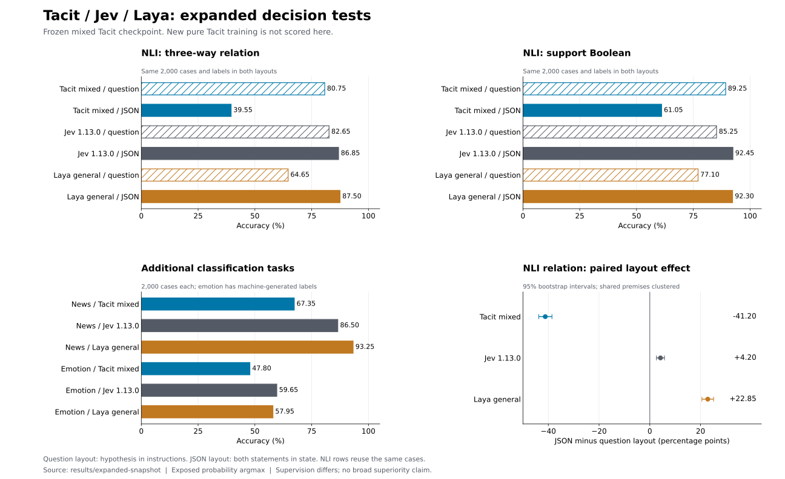

# Expanded comparison: format robustness changes the result

These measurements test the **previously frozen mixed Tacit checkpoint**, the
same released general Laya checkpoint, and official Jev 1.13.0. The new pure
Tacit training run is separate and has not completed test evaluation. Overall
superiority is not established; the expanded tests expose substantial weaknesses
in the previous Tacit model.



| Task, 2,000 decisions per row | Tacit mixed | Jev 1.13.0 | Laya general |
|---|---:|---:|---:|
| NLI relation, hypothesis in question | 80.75% | 82.65% | 64.65% |
| NLI relation, premise and hypothesis in JSON | 39.55% | 86.85% | 87.50% |
| NLI support Boolean, hypothesis in question | 89.25% | 85.25% | 77.10% |
| NLI support Boolean, premise and hypothesis in JSON | 61.05% | 92.45% | 92.30% |
| AG News topic classification, four choices | 67.35% | 86.50% | 93.25% |
| Emotion classification, six choices | 47.80% | 59.65% | 57.95% |

The four NLI rows reuse the **same 2,000 examples**. They are correlated tests,
not 8,000 independent examples. All models receive identical requests within a
row. The original layout puts the premise in state and the hypothesis in each
question. The JSON layout puts both statements in state and uses generic
instructions; gold labels are unchanged.

Changing to JSON reduces Tacit's relation accuracy by **41.20 percentage points**
(paired 95% interval [-43.76, -38.56]), while Laya improves by **22.85 points**
([+20.53, +25.14]) and Jev by **4.20 points** ([+2.61, +5.79]). Bootstrap resampling
keeps hypotheses sharing a premise together, stratifies by genre and uses 10,000
resamples with seed 2026. This evidence contradicts interpreting the original
Tacit/Laya NLI difference as general model superiority.

The same frozen Tacit mixed checkpoint scores 71.10% on the four workflows. The
separate refined Tacit checkpoint scores 72.15%; Jev scores 73.45%; Laya's typed
workflow checkpoint scores 76.80%, versus 36.10% for its general checkpoint. Those
variants remain separate in the [original comparison](DIRECT_COMPARISON.md).
There is no tree model or score blending in any reported Tacit result.

## Data and measurement limits

AG News uses a frozen 2,000-example sample from its 7,600-example official test
split. The remaining 5,600 have not been scored in this expanded test. Emotion
uses all 2,000 examples in its official test split. Its labels are
machine-generated, so this is label agreement rather than independent human
verification of emotional meaning.

The [input audit](../results/expanded-snapshot/data-audit.json) finds no Laya
truncation on either NLI layout, news or emotion. The earlier 34 truncated
workflow decisions remain disclosed. Local expanded evaluation ran concurrently
with training and reports accuracy only; no new latency advantage is claimed.

Jev probability argmax remains the common scoring protocol. Scoring its returned
`choice` field instead gives 86.80% on JSON NLI relation, 86.55% on news and 59.70%
on emotion. Both are audited. Its rounded zero probabilities also raise exposed
NLL; they do not reveal internal full-precision probability quality. Full metrics,
including Brier, ECE, NLL and paired intervals, are in the snapshot.

Dataset revisions:

- MultiNLI: `da70db2af9d09693783c3320c4249840212ee221`.
- [AG News](https://huggingface.co/datasets/fancyzhx/ag_news):
  `eb185aade064a813bc0b7f42de02595523103ca4`; retain source terms.
- [Emotion](https://huggingface.co/datasets/dair-ai/emotion):
  `cab853a1dbdf4c42c2b3ef2173804746df8825fe`; research/education restrictions.

The new training corpus has 144,886 cases before workflow replay, with no shared
split IDs, NLI premises or normalized auxiliary texts across training, validation,
calibration and test. It includes 96,002 NLI training cases split between the two
layouts, 32,000 news examples, 15,984 emotion examples and 900 workflow examples.
The old mixed checkpoint evaluated here was trained on the earlier 24,000-NLI
corpus; it was not trained on news, emotion or JSON NLI.

## Cumulative API budget

The user raised the cumulative cap from **$0.50 to $5.00**. The ledger retains all
old charges and unresolved reservations; this is not a new $5 allowance on top
of previous spending.

For the 8,400 successful requests through this snapshot, reported input tokens
imply **$0.167640564** in charges at the pinned price. This includes
**$0.113769264** for the 6,000 added requests. The failed Gateway attempt retains
an $0.008064 reservation and one official API timeout retains $0.005376, for
**$0.181080564 committed**. These are usage calculations, not reconciled invoices.
The timeout was recovered in a separate explicit run that reserved again;
already saved responses were reused. No automatic retries occur within a run.

An explicit budget change can be applied with `benchmarks/gateway_budget.py
--set-cap ... --reason ...`; it preserves entries and records a cap-change audit
event. Evaluators reuse the stored cumulative cap instead of silently resetting
it. Credentials and the full private ledger are excluded from publication.

## Reproduce and inspect

The [expanded snapshot](../results/expanded-snapshot/) contains independently
rescored predictions, whitelisted Jev answers/usage, checkpoint identities,
corpus hashes, truncation audit, intervals and checksums. Each local model's
original and expanded runs must match the same checkpoint SHA before export.

```bash
python benchmarks/evaluate_general.py --model laya --corpus .cache/general-v2 \
  --families nli-structured news emotion --accuracy-only \
  --output results/general/laya-expanded-test.json
python benchmarks/evaluate_general.py --model tacit \
  --checkpoint results/general/mixed-seed0 --corpus .cache/general-v2 \
  --families nli-structured news emotion --accuracy-only \
  --output results/general/tacit-mixed-expanded-test.json
python benchmarks/jev_official.py --suite expanded --limit 6000 --concurrency 4
python benchmarks/audit_general.py --corpus .cache/general-v2 \
  --output results/general/expanded-data-audit.json
python benchmarks/publish_expanded.py
python benchmarks/plot_expanded.py
```

Repeated public-test inspection, one Tacit training seed, supervision differences
and the absence of a completed fresh final gate prevent a broad superiority
claim. Development follows the [pure Tacit rules](PURE_TACIT.md).

A separate [frozen, unscored gate](../results/final-gate-manifest.json) now contains
2,002 previously unused NLI examples in both layouts and 2,000 unused news
examples: 6,004 requests / 10,008 decisions. Complete premise groups can exceed
the requested sample size slightly. Every previously used corpus split is
excluded by input group and ID. `python benchmarks/freeze_general_gate.py`
reproduces the selection without reading predictions or calling a model; it
refuses to overwrite an existing gate. This gate covers NLI and news only and
does not replace the remaining workflow, emotion, calibration or efficiency
requirements.
